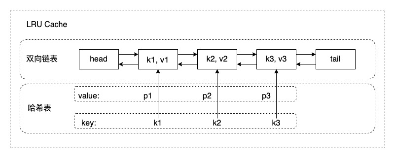

## [146. LRU Cache](https://leetcode.com/problems/lru-cache/)

Design and implement a data structure for Least Recently Used (LRU) cache. It should support the following operations: get and put.

get(key) - Get the value (will always be positive) of the key if the key exists in the cache, otherwise return -1.
put(key, value) - Set or insert the value if the key is not already present. When the cache reached its capacity, it should invalidate the least recently used item before inserting a new item.

The cache is initialized with a positive capacity.

Could you do both operations in O(1) time complexity?

## 思路

1、O(1) 的 get 和 set？

那就只能用 **哈希表** 数据结构了。

2、删除过期的 key? 

也就说，key 是 **有序的** （按 get/set 的时间排序），所以需要一个有序的数据结构来存储 key。满足有序的数据结构有数组、链表、搜索树、跳表等。

3、删除和插入 key 也需要 O(1)？

那就只有 **链表** 了，实现过程中发现 **双向链表** 更合适，因为需要用到节点的左节点指针。

综上，需要 **哈希表 + 双向链表** 两个数据结构来实现 O(1) 的 LRU Cache。画个图直观感受下：



## 解答

小技巧，双向链表添加头尾两个 dummy 节点，可以省掉好多 if-else

```python
from typing import Dict


class LinkedListNode:
    
    def __init__(self, key: int, val: int):
        self.key: int = key
        self.val: int = val
        self.pre: 'LinkedListNode' = None
        self.next: 'LinkedListNode' = None
     
    
class LRUCache:

    def __init__(self, capacity: int):
        self._size = 0
        self._capacity = capacity
        self._head = LinkedListNode(-1, -1)
        self._tail = LinkedListNode(-1, -1)
        self._head.next = self._tail
        self._tail.pre = self._head
        self._map: Dict[int, LinkedListNode] = dict()

    def get(self, key: int) -> int:
        node = self._map.get(key)
        if node:
            self._move_node_to_front(node)
            return node.val
        return -1

    def put(self, key: int, value: int) -> None:
        if key in self._map:
            self._map[key].val =  value
            self._move_node_to_front(self._map[key])
        else:
            self._insert_node(key, value)

    def _move_node_to_front(self, node: LinkedListNode):
        pre, next_ = node.pre, node.next
        pre.next, next_.pre = next_, pre
        
        node.next = self._head.next
        node.pre = self._head
        self._head.next.pre = node
        self._head.next = node
    
    def _insert_front(self, key, val):
        self._size += 1
        node = LinkedListNode(key, val)
        self._map[key] = node
        
        node.next = self._head.next
        node.pre = self._head
        self._head.next.pre = node
        self._head.next = node
    
    def _delete_ex(self):
        ex_node = self._tail.pre
        ex_key = ex_node.key
        self._tail.pre = ex_node.pre
        ex_node.pre.next = self._tail
        ex_node.pre = None
        ex_node.next = None
        del self._map[ex_key]
        self._size -= 1
        
    def _insert_node(self, key, val):
        if self._size >= self._capacity:
            self._delete_ex()
        self._insert_front(key, val)  
```